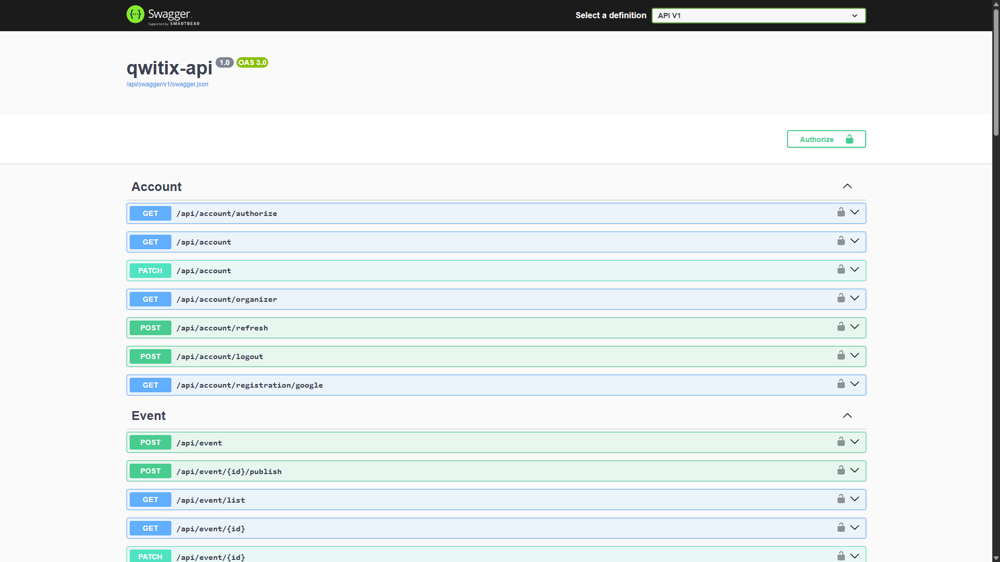

<table>
  <tr>
    <td width='1200px' height='150px' align="center">
      <div display="">
        
        <h1><strong>Qwitix-api</strong></h1>
      </div>
    </td>
  </tr>

<tr>
 <td>
  <p align='center'>
    
    
    
    
    
    
    
    
  </p>
 </td>
</tr>
</table>

## 📝 Description

**Qwitix API** is the backend of a ticket sales platform for concerts and events. It was developed as part of a **first-year university course project**, using modern technologies.

### 🔧 Key Features & Technologies

- ⚙️ Built with **ASP.NET Core** as the main backend framework  
- 🍃 Uses **MongoDB** as a document-oriented NoSQL database  
- ☁️ Stores images and media files in **Azure Blob Storage**  
- 💳 Integrates **Stripe** for secure and seamless online payments  
- 🔐 Implements **custom Google OAuth** authentication with **JWT** token generation  
- 🐳 Fully containerized with **Docker**, using `docker-compose` for multi-container orchestration  
- 🧱 Designed following **SOLID principles** and **Onion Architecture** for scalability and clean separation of concerns  
- 🚀 **Deployed to an Azure Virtual Machine**, running in a secure production-like environment  

> 📦 For more details about deployment and infrastructure setup, see the [**Qwitix-Infra**](https://github.com/Fyz-dev/qwitix-infra) repository.
## 📸 Swagger UI


## 🔧Installation

1. Cloning the repository

```bash
git clone https://github.com/Fyz-dev/qwitix-api.git
```

2. Environment setup
Duplicate the example environment file and fill in all required variables.
```bash
cp .env.example .env
```
Open .env in your favorite editor and provide the necessary configuration values (e.g. database connection string, Stripe keys, Azure credentials, JWT secrets, etc.).

3. Run the project using Docker Compose
Once the .env file is configured, you can spin up the entire environment.
```bash
docker compose --env-file .env up
```
4. Stripe CLI for local payment testing
To test Stripe webhooks locally, make sure you have the Stripe CLI installed. Then run the following command in a separate terminal.
```bash
stripe listen --forward-to localhost:8080/api/stripe/webhooks
```
>📖 More information about Stripe CLI can be found in the official documentation [**Stripe**](https://docs.stripe.com/webhooks#test-webhook)

5. 📦 That’s it!
